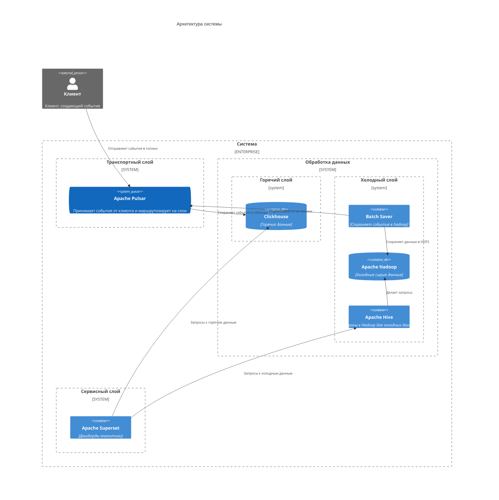

# Система потоковой обработки событий от клиентов маркетплейса

## Описание

Архитектура системы похожа на Lambda архитектуру:
- Транспортный слой 
- Слой горячих данных
- Слой холодных данных
- Сервисный слой

События отправляются на транспортный слой, откуда они маршрутизируются в соответствующие слои (горячий, холодный).
Данные из слоев доступны с помощью сервисного слоя.

## Выбор технологий

Транспортный слой: `Apache Pulsar`
- Поддерживает типизацию
- Можно настроить маршрутизацию на слои
- Поддерживает версионирование (на будущее)

Горячий слой: `ClickHouse`
- Событий может быть много и записывать их нужно быстро
- Нужна быстрая аналитика
- При необходимости можно создать материализованные представления

Холодный слой: `Apache Hadoop + Apache Hive`
- Событий может быть очень много и места, ими занимаемое, может расти быстро
- Для аналитики используем Apache Hive, он запускается по требованию

Сервисный слой: `Apache Superset`
- Поддерживает взаимодействие с Clickhouse и Apache Hive

P.S. ранее с Superset не работал, изначально хотел Grafana, но это не BI инструмент

## Архитектура

# Сервисы

## Apache Pulsar

Используется как `транспортный слой`.

Все события отправляются в него и дальше маршрутизируются в нужные слои.
Для каждого события - отдельная очередь. 

События имеют схему (внутри топиков).

Причины выбора:
- Версионирование записей 
- Коннектор Clickhouse (не надо писать велосипеды)
- Поддержка одновременных консьюмеров для множественных групп

## Clickhouse

Используется для хранения горячих данных.

Данные хранятся в таблицах: для каждого события - своя таблица.
Для данных представления используются материализованные представления.

Причины выбора:
- Кластеризация
- Скорость аналитических запросов
- Скорость записи
- SQL (подобный язык)

## Batch Saver 

Отдельное приложение, которое подписывается на топики событий Apache Pulsar и сохраняет прочитанные события в Apache Hadoop.

Для оптимизации, запись происходит батчами (дозапись в файл).

Причины выбора:
- Для меня на Python это писать проще
- Есть много библиотек для Python
- Не нашел коннектора для Apache Hadoop (для Pulsar)

## Apache Hadoop

Используется для хранения холодных данных.

Для каждого события - отдельный файл.
Формат файла - CSV. События (записи) хранятся в соответствующем формате.

Причины выбора:
- Кластеризация 
- Отказоустойчивость
- Поддержка больших данных

## Apache Hive

Выполняет запросы к холодным данным в Apache Hadoop.

Причины выбора:
- Гибкость запросов
- SQL (подобный язык)

## Apache Superset

Сервисный слой для создания BI дашбордов.
Делает запросы к Clickhouse и Apache Hive для их получения.

Причины выбора:
- Поддержка Clickhouse и Hive
- Бесплатный

> Я никогда не работал с Apache Superset. 
> Изначально хотел сделать с помощью Grafana, но при работе с холодными данными возникли трудности (частые запросы будут сильно грузить).
> Superset - единственное, что нашел с поддержкой Docker, Clickhouse и Hive

# Алгоритм работы и запуск

