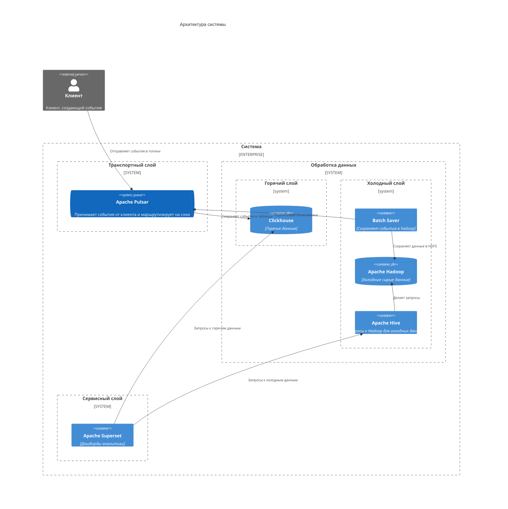

# Система потоковой обработки событий от клиентов маркетплейса

## Описание

Архитектура системы похожа на Lambda архитектуру:
- Транспортный слой 
- Слой горячих данных
- Слой холодных данных
- Сервисный слой

События отправляются на транспортный слой, откуда они маршрутизируются в соответствующие слои (горячий, холодный).
Данные из слоев доступны с помощью сервисного слоя.

## Выбор технологий

Транспортный слой: `Apache Pulsar`
- Поддерживает типизацию
- Можно настроить маршрутизацию на слои
- Поддерживает версионирование (на будущее)

Горячий слой: `ClickHouse`
- Событий может быть много и записывать их нужно быстро
- Нужна быстрая аналитика
- При необходимости можно создать материализованные представления

Холодный слой: `Apache Hadoop + Apache Hive`
- Событий может быть очень много и места, ими занимаемое, может расти быстро
- Для аналитики используем Apache Hive, он запускается по требованию

Сервисный слой: `Apache Superset`
- Поддерживает взаимодействие с Clickhouse и Apache Hive

P.S. ранее с Superset не работал, изначально хотел Grafana, но это не BI инструмент

## Архитектура

# Сервисы

## Apache Pulsar

Используется как `транспортный слой`.

Все события отправляются в него и дальше маршрутизируются в нужные слои.
Для каждого события - отдельная очередь. 

События имеют схему (внутри топиков).

Причины выбора:
- Версионирование записей 
- Коннектор Clickhouse (не надо писать велосипеды)
- Поддержка одновременных консьюмеров для множественных групп

## Clickhouse

Используется для хранения горячих данных.

Данные хранятся в таблицах: для каждого события - своя таблица.
Для данных представления используются материализованные представления.

Причины выбора:
- Кластеризация
- Скорость аналитических запросов
- Скорость записи
- SQL (подобный язык)

## Batch Saver 

Отдельное приложение, которое подписывается на топики событий Apache Pulsar и сохраняет прочитанные события в Apache Hadoop.

Для оптимизации, запись происходит батчами (дозапись в файл).

Причины выбора:
- Для меня на Python это писать проще
- Есть много библиотек для Python
- Не нашел коннектора для Apache Hadoop (для Pulsar)

## Apache Hadoop

Используется для хранения холодных данных.

Для каждого события - отдельный файл.
Формат файла - CSV. События (записи) хранятся в соответствующем формате.

Причины выбора:
- Кластеризация 
- Отказоустойчивость
- Поддержка больших данных

## Apache Hive

Выполняет запросы к холодным данным в Apache Hadoop.

Причины выбора:
- Гибкость запросов
- SQL (подобный язык)

## Apache Superset

Сервисный слой для создания BI дашбордов.
Делает запросы к Clickhouse и Apache Hive для их получения.

Причины выбора:
- Поддержка Clickhouse и Hive
- Бесплатный

> Я никогда не работал с Apache Superset. 
> Изначально хотел сделать с помощью Grafana, но при работе с холодными данными возникли трудности (частые запросы будут сильно грузить).
> Superset - единственное, что нашел с поддержкой Docker, Clickhouse и Hive

# События системы

## PageVisit

Просмотр пользователем страницы продукта

| Поле      | Тип      | Описание               |
|-----------|----------|------------------------|
| timestamp | datetime | Время события          |
| user_id   | int      | ID пользователя        |
| page_id   | int      | ID посещенной страницы |

Топик: `page-visit`

Таблица: `page_visits`

## Searching

Использование пользователем строки поиска

Схема:

| Поле      | Тип      | Описание        |
|-----------|----------|-----------------|
| timestamp | datetime | Время события   |
| user_id   | int      | ID пользователя |
| query     | string   | Строка поиска   |

Топик: `searching`

Таблица: `searchings`

## Filtering

Применение фильтров и сортировок в поиске

Схема:

| Поле       | Тип      | Описание             |
|------------|----------|----------------------|
| timestamp  | datetime | Время события        |
| user_id    | int      | ID пользователя      |
| price_min  | double?  | Минимальная цена     |
| price_max  | double?  | Максимальная цена    |
| rating_min | double?  | Минимальный рейтинг  |
| rating_max | double?  | Максимальный рейтинг |

Топик: `filtering`

Таблица: `filterings`

## CartAdd

Добавление товара в корзину

Схема:

| Поле      | Тип      | Описание               |
|-----------|----------|------------------------|
| timestamp | datetime | Время события          |
| user_id   | int      | ID пользователя        |
| item_id   | int      | ID добавленного товара |

Топик: `cart-add`

Таблица: `cart_adds`

## CartDelete

Удаление из корзины

Схема:

| Поле      | Тип      | Описание             |
|-----------|----------|----------------------|
| timestamp | datetime | Время события        |
| user_id   | int      | ID пользователя      |
| item_id   | int      | ID удаленного товара |

Топик: `cart-delete`

Таблица: `cart_deletes`

## Ordering

Оформление заказа пользователем

Схема:

| Поле      | Тип      | Описание        |
|-----------|----------|-----------------|
| timestamp | datetime | Время события   |
| user_id   | int      | ID пользователя |
| order_id  | int      | ID заказа       |

Топик: `ordering`

Таблица: `orderings`

## OrderCancel

Отмена заказа

Схема:

| Поле      | Тип      | Описание              |
|-----------|----------|-----------------------|
| timestamp | datetime | Время события         |
| user_id   | int      | ID пользователя       |
| order_id  | int      | ID отмененного заказа |

Топик: `order-cancel`

Таблица: `order_cancels`

## ReviewReview

Просмотр отзыва

Схема:

| Поле      | Тип      | Описание        |
|-----------|----------|-----------------|
| timestamp | datetime | Время события   |
| user_id   | int      | ID пользователя |
| review_id | int      | ID отзыва       |

Топик: `review-review`

Таблица: `review_reviews`

## ReviewCreating

Создание нового отзыва

| Поле      | Тип      | Описание                             |
|-----------|----------|--------------------------------------|
| timestamp | datetime | Время события                        |
| user_id   | int      | ID пользователя                      |
| review_id | int      | ID созданного отзыва                 |
| item_id   | int      | ID товара, на который создан отзыв   |

Топик: `review-creating`

Таблица: `review_creatings`

## Registering

Регистрация пользователя

| Поле      | Тип      | Описание              |
|-----------|----------|-----------------------|
| timestamp | datetime | Время события         |
| user_id   | int      | ID пользователя       |

Топик: `registering`

Таблица: `registerings`

## LoggingIn

Вход пользователя в аккаунт

| Поле       | Тип      | Описание                               |
|------------|----------|----------------------------------------|
| timestamp  | datetime | Время события                          |
| user_id    | int      | ID пользователя                        |
| login_type | int      | Тип авторизации, который использовался |

login_type:
- 0 - почта/пароль
- 1 - телефон и одноразовый код
- 2 - внешний сервис

Топик: `logging-in`

Таблица: `logging_ins`

## ProfileEdit

Изменение данных профиля

| Поле      | Тип      | Описание              |
|-----------|----------|-----------------------|
| timestamp | datetime | Время события         |
| user_id   | int      | ID пользователя       |

Топик: `profile-edit`

Таблица: `profile_edits`

## MailingSubscription

Подписка на рассылку

| Поле              | Тип      | Описание                 |
|-------------------|----------|--------------------------|
| timestamp         | datetime | Время события            |
| user_id           | int      | ID пользователя          |
| subscription_type | int      | Тип оформленной подписки |

subscription_type:
- 1 - все
- 2 - новостная рассылка
- 3 - акции и распродажи

Топик: `mailing-subscription`

Таблица: `mailing_subscriptions`

## SupportContact

Обращение в службу поддержки

| Поле         | Тип      | Описание                                   |
|--------------|----------|--------------------------------------------|
| timestamp    | datetime | Время события                              |
| user_id      | int      | ID пользователя                            |
| support_type | int      | Способ взаимодействия (почта, звонок, чат) |

support_type:
- 1 - почта
- 2 - звонок
- 3 - чат

Топик: `support-contact`

Таблица: `support_contacts`

## RecommendationView

Просмотр рекомендаций

| Поле             | Тип      | Описание                                   |
|------------------|----------|--------------------------------------------|
| timestamp        | datetime | Время события                              |
| user_id          | int      | ID пользователя                            |
| duration_seconds | double   | Время (в секундах) затраченное на просмотр |

Топик: `recommendation-view`

Таблица: `recommendation_views`

## SaleParticipation

Участие в акциях и распродажах

| Поле      | Тип      | Описание                       |
|-----------|----------|--------------------------------|
| timestamp | datetime | Время события                  |
| user_id   | int      | ID пользователя                |
| sale_id   | int      | ID распродажи                  |
| item_id   | int      | Товар, купленный по этой акции |

Топик: `sale-participation`

Таблица: `sale_participations`

## ItemComparison

Сравнение товаров: характеристики, цена и др. атрибуты

| Поле            | Тип      | Описание          |
|-----------------|----------|-------------------|
| timestamp       | datetime | Время события     |
| user_id         | int      | ID пользователя   |
| first_item_id   | int      | ID одного товара  |
| second_item_id  | int      | ID другого товара |
| comparison_type | int      | Типы сравнения    |

comparison_type:
- 0 - другое/все (если не единственный атрибут)
- 1 - цена
- 2 - характеристики
- 3 - дата доставки

Топик: `item-comparison`

Таблица: `item_comparisons`

## OrderHistoryViewing

Просмотр предыдущих заказов и их статусов

| Поле             | Тип      | Описание                                             |
|------------------|----------|------------------------------------------------------|
| timestamp        | datetime | Время события                                        |
| user_id          | int      | ID пользователя                                      |
| duration_seconds | double   | Время проведенное за просмотром истории (в секундах) |

Топик: `order-history-viewing`

Таблица: `order_history_viewings`

## ItemReturn

Возврат товара

| Поле                | Тип      | Описание                                  |
|---------------------|----------|-------------------------------------------|
| timestamp           | datetime | Время события                             |
| user_id             | int      | ID пользователя                           |
| item_id             | int      | ID возвращенного товара                   |
| order_id            | int      | ID заказа, которому принадлежит товар     |
| reason_type         | int      | Причина возврата                          |
| reason_user_message | string?  | Сообщение пользователя о причине возврата |

reason_type:
- 0 - другое (сообщение о причине содержится в reason_user_message)
- 1 - Брак/неисправность
- 2 - Истек срок годности
- 3 - Неподошёл размер
- 4 - Низкое качество 

Топик: `item-return`

Таблица: `item_returns`

## PromoUsage

При оформлении заказа использован купон

| Поле      | Тип      | Описание                               |
|-----------|----------|----------------------------------------|
| timestamp | datetime | Время события                          |
| user_id   | int      | ID пользователя                        |
| coupon_id | int      | ID использованного купона/промокода    |
| order_id  | int      | ID заказа, для которого купон применен |

Топик: `promo-usage`

Таблица: `promo_usages`

## CategoryView

Переход и просмотр различных категорий и подкатегорий

| Поле               | Тип      | Описание                                 |
|--------------------|----------|------------------------------------------|
| timestamp          | datetime | Время события                            |
| user_id            | int      | ID пользователя                          |
| category_id        | int      | ID категории на которую совершен переход |
| parent_category_id | int?     | ID категории с которой произошел переход |

Топик: `category-view`

Таблица: `category_views`

# Алгоритм работы и запуск

